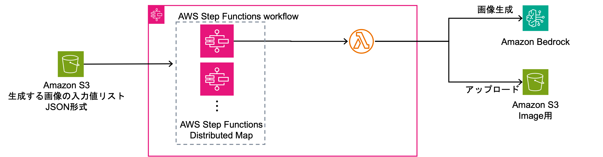
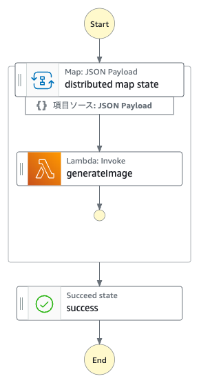
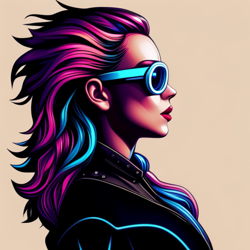

# プロジェクト概要

NFTの配布等のために一括で大量のNFT用の画像が必要となることがある。NFTでよくある世界観やキャラクターデザインを統一した上で髪型やアクセサリー等が少し異なる画像を大量に生成したいときに本アセットを活用することができる。
Amazon Bedrockの生成AIを活用した画像生成用のプログラムに対して入力値(例: IDやレアリティ)を渡すと、入力値を乱数のシード値として画像を生成する。
入力値にはbase64形式に変換した画像を設定することができ、コンセプトや世界観を引き継ぎながら複数のバリエーションの画像を生成することができる。

# アーキテクチャ図

# ドキュメント

- [設計指針](./docs/architecture.md)
- [構築手順書](./docs/howToDeploy.md)

# 画像生成の例

  
Amazon Bedrockで生成した入力画像

AWS Step FunctionsとBedrockで生成した画像

## Security

See [CONTRIBUTING](CONTRIBUTING.md#security-issue-notifications) for more information.

## License

This library is licensed under the MIT-0 License. See the LICENSE file.
