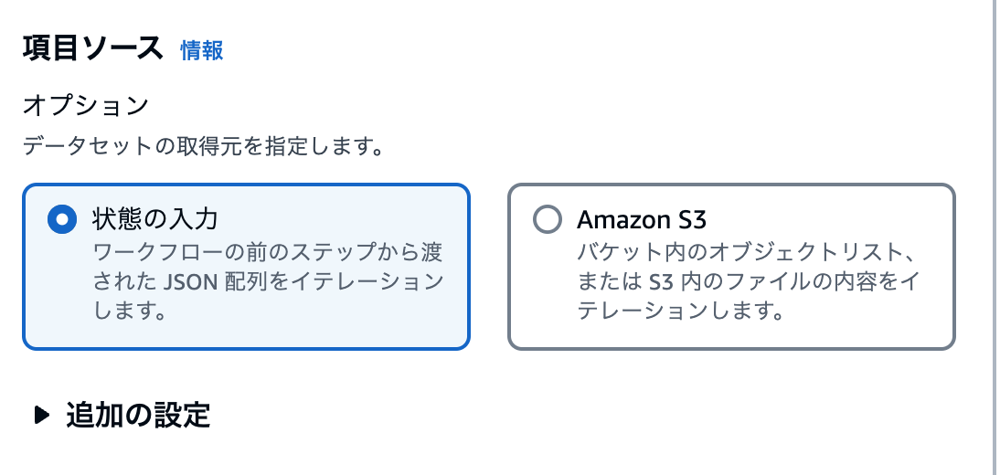

## 設計指針

ワークフローの定義は、AWS Cloud Development Kit(AWS CDK)を用いてTypescriptによるソースコードの形式で定義する。

Lambdaのファンクション定義については `cdk/lambda/nodejs/functionDefinitons` にtypescriptを用いてJSON形式で設定することができる。Lambdaの実行コードは、 `cdk/lambda/nodejs/image` に保存する。
CDKでは `functionDefinitons` フォルダに含まれる全ての設定ファイルを読み取り、設定値の内容でsfnのlambda invokeを作成する。lambda invokeに設定するメモリや環境変数等はこの設定ファイルで定義すること。

```
├── lambda
│   ├── nodejs
│   │   ├── functionDefinitions
│   │   │   ├── generateImage.ts
│   │   └── image
│   │   │   ├── lib
│   │   │   ├── generateImage.ts
│   │   │   ├── package.json
│   │   │   └── tsconfig.json
```


### StepFunctions ステートマシンを実行するためのトリガーについて

このワークフローは、外部システムがStepFunctionsのStateMachineに対して `StartExecution` を実行したところから処理を開始します。マネジメントコンソールのStepFunctionsの画面から手動で実行しても良い。
`StartExecution` 実行時のパラメータは下記の公式ドキュメントを参照してください。

[API Reference: Start Execution](https://docs.aws.amazon.com/step-functions/latest/apireference/API_StartExecution.html)  

StartExecutionの実行の前に、画像生成用Lambda関数に渡す情報(IDやレアリティなど)をJSONのList形式でS3に保存する。 StartExecutionのパラメータにS3のパスを設定すると、リストの数だけ画像を生成することができる。
Listの作成方法は [画像生成用Lambdaに渡すパラメータのリストの自動生成](#画像生成用lambdaに渡すパラメータのリストの自動生成) を参照

> 初期段階ではS3のパスを指定することになっているが、Step Functionsの Distributed Mapの項目ソースを 'Amazon S3` から `状態の入力` に変更することで、直接JSON形式のListを渡すことができる。



### エラー発生時の処理について

エラーの種別に応じてリトライを3-6回実施、リトライ間隔2-5秒、backoffRate2.0で設定している。 `Exponential Backoff` によるリトライ間隔の調整を行う。


### 画像生成用Lambdaに渡すパラメータのリスト

- Step Functionsの Distributed Mapではリストを対象に最大1万並列で実行することができる。  
  > BedrockやLambda等のQuotaで定義されている各種制限が並列実行する上での制約となるため注意が必要。

パラメータはJSON形式で定義すること。

| パラメータ名 | 意味 | 設定値の例 |
|------------|-----|-----------|
|id | ID | A0001 |
|rank | レアリティ | normal|
|inputBucketName | 生成した画像を保存するS3 Bucketの名前| 111122223333-aa-example-1-input-image-bucket|
|inputKeyName | 生成した画像を保存するファル名 |image.jpeg|
|model| 画像生成に使用するモデル名 |stability.stable-diffusion-xl-v0|
|prompt| 画像生成に使用するプロンプト|hair color is brown, backglound color is white|
 
```
[
  {
    "id":"A1",
    "rank":"nomal",
    "inputBucketName":"111122223333-aa-example-1-input-image-bucket",
    "inputKeyName":"image.jpeg",
    "model":"stability.stable-diffusion-xl-v0",
    "prompt":"hair color is brown, backglound color is white"
  },
  {
    "id":"A2",
    "rank":"vip",
    "inputBucketName":"111122223333-aa-example-1-input-image-bucket",
    "inputKeyName":"image.jpeg",
    "model":"stability.stable-diffusion-xl-v0",
    "prompt":"hair color is gold, backglound color is red"
  },
]
```

### 画像生成用Lambdaに渡すパラメータのリストの自動生成

コマンドラインツールとしてリストの自動生成ツールを用意している。 `tools` ディレクトリにある `generateIdList.ts` をrankと生成個数を指定して実行することで、JSON形式のリストが作成される。
このファイルをS3 Bucketの `<account id>-<region name>-unprocessed-id-list-bucket` に保存すると、Step FunctionsのDistributed Mapから読み取られる。

```
$ npx ts-node generateIdList.ts --rank nomal --number 100
```


### Input

Step Functionsのステートマシン起動時に設定するパラメータ。JSON形式で定義すること。

| パラメータ名 | 意味 | 設定値の例 |
|------------|-----|-----------|
|bucketName| 画像生成用Lambdaに渡すパラメータのリストが含まれているS3 Bucket|111122223333-aa-example-1-unprocessed-id-list-bucket|
|bucketKey| 画像生成用Lambdaに渡すパラメータのリストのファイル名|nomal.json|


