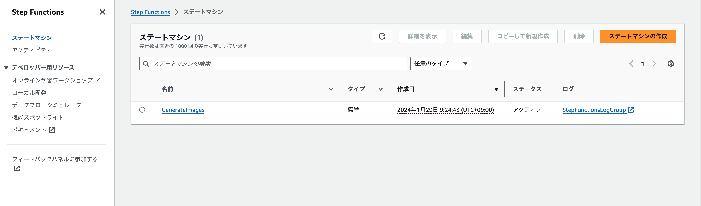
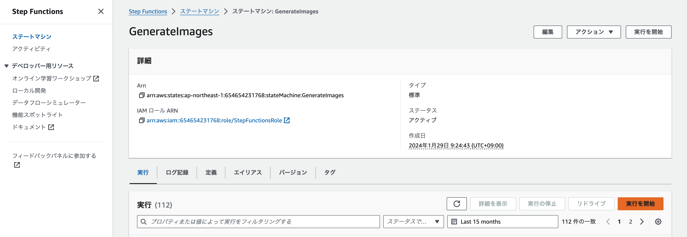

環境構築手順
===

## 前提条件

> AWS Cloud9もしくはAmazon CodeCatalyst の環境で作業すること、下記の要件を比較的容易に満たすことができます。

- AWS Cloud Development Kit(AWS CDK) v2を使用します。

- CDKの実行端末の推奨スペック
  - OS: Amazon Linux2 or Amazon Linux2023推奨
  - CPU:      4 vCPU
  - Memory:   8 GB
  - Storage: 32 GB
- 依存パッケージ
  - nodejs: v20.6.1 以上
  - docker: Docker version 24.0.5, build ced0996
  - aws-cli: aws-cli/2.15.8 Python/3.11.6 Linux/6.1.66-91.160.amzn2023.x86_64 exe/x86_64.amzn.2023 prompt/off

- リージョンは `ap-northeast-1` を使用する。Amazon Bedrockのみ `us-east-1` を使用する。

## AWS CLIの初期設定

AWSのCLIを使用するためのcredentialsを登録する。aws-cliコマンドの `aws configure` もしくは環境変数に登録のどちらかを実施する。

- aws configureコマンドで設定する場合
  ```
  $ aws configure
  AWS Access Key ID [None]: you aws access key id
  AWS Secret Access Key [None]: your aws secret access key
  Default region name [None]: aa-example-1
  Default output format [None]: 
  ```

- 環境変数で設定する場合
  ```
  export AWS_ACCESS_KEY_ID=
  export AWS_SECRET_ACCESS_KEY=
  export AWS_REGION=aa-example-1
  ```


## CDKの設定

- `cdk.json` を編集し、CDKで使用する設定項目を変更する。

```
$ pwd
/projects/workflow/cdk
$ vi cdk.json

"VPC_CIDR": "172.16.1.0/16",      // VPCStack.tsで新規のVPCを作成する場合に設定する。
"VPC_ID": "vpc-1234567890abcdef0" // VPCStack.tsで既存のVPCを使用する場合に設定する。
```

|項目名|意味|
|-----|---|
|VPC_CIDR|VPCをCDKで作成する場合に使用する。VPCが使用するCIDRの範囲を定義する|
|VPC_ID|CDKが使用するVPCのIDを設定する。既存のVPCやCDKで作成したVPCのIDを使用する|


## 依存パッケージのインストール
- cdkの依存パッケージ
  ```
  $ pwd
  /projects/NFT_Image_Generator/cdk
  $ npm install
  ```
- lambdaの依存パッケージ
  ```
  $ cd lambda/nodejs/image/
  $ npm install

  $ cd ../../../
  $ pwd
  /projects/NFT_Image_Generator/cdk
  ```

## CDKの初期設定

> 下記のコマンドはデプロイを実施するリージョンでAWS CDKを使用していない場合のみ実施する

- CDKの初期設定を実施する
```
$ pwd
/projects/NFT_Image_Generator/cdk
$ npx cdk bootstrap
```

- Lambda Functionsの設定を変更する
  `cdk/lambda/nodejs/functionDefinitions` のフォルダにある設定ファイルを変更する。

  基本的には CDKの `NodejsFunction` のフォーマットで記述する。
  https://docs.aws.amazon.com/cdk/api/v2/docs/aws-cdk-lib.aws_lambda_nodejs.NodejsFunction.html

  - `NodejsFunction` に定義がない設定値について

    |パラメータ名| 用途|
    |---------|----|
    |ignoreError|このタスクで失敗した場合に処理を継続するフラグ。true: 処理継続, false: 終了. (sfnのCustomStateを使用する場合はこのパラメータは効かないので注意)
    |retry| タスク失敗時にStepFunctionsの機能でリトライを実施するフラグ|true: リトライを実施する, false: リトライを実施しない(sfnのCustomStateを使用する場合はこのパラメータは効かないので注意)|


## CDKによる環境構築

### VPCの作成

本手順はVPCを新規に作成する場合にのみ実施する。

- VPCの作成
  ```
  $ pwd
  /projects/workflow/cdk
  $ npx cdk deploy VPCStack
  ```

- `cdk.json` にVPCのIDを設定する
  ```
  $ vi cdk.json

  "VPC_ID": "vpc-1234567890abcdef0",
  ``` 

### StepFunctionsのワークフローを作成

- ワークフローを作成
  ```
  $ npx cdk deploy SfnWorkFlowStack
  ```


## 使い方

Distributed Mapで生成する画像パラメータのリストを [画像生成用lambdaに渡すパラメータのリストの自動生成](./architecture.md#画像生成用lambdaに渡すパラメータのリストの自動生成) を参考に作成する。  

`<account id>-<region name>-unprocessed-id-list-bucket` に保存する

マネジメントコンソールより、StepFunctionsの管理画面に遷移する



`GenerateImages` を開き、 `実行を開始` ボタンを押下する



StateMachineに渡すパラメータを入力するモーダルが表示される。 [画像生成用lambdaに渡すパラメータのリストの自動生成](./architecture.md#画像生成用lambdaに渡すパラメータのリストの自動生成) で作成しS3 BucketにアップロードしたJSONファイルの `S3 Bucket名` と `ファイル名` をJSON形式で入力する。入力後に `実行を開始` ボタンを押下する。

```
{
  "bucketName": "111122223333-aa-example-1-unprocessed-id-list-bucket",
  "bucketKey": "test.json"
}
```


StateMachineの実行画面に自動で遷移したら、画面中央の `グラフビュー` より、`distributed map state` と書かれた四角枠を押下する。すると画面右側に `マップ実行` ボタンが表示される。

`マップ実行` ボタンを押下し、distributed mapの詳細画面(子ワークフロー)を表示する。


この画面でDistributed Mapの実行状態や処理時間を確認することができる。

